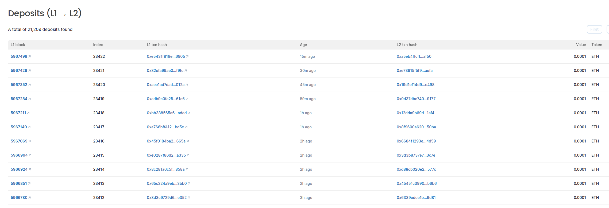

# Polygon CDK/zkEVM Blockscout Package
This is a Kurtosis based stack to deploy Blockscout on arbitrary CDK/zkEVM based chain.

## Configuration
Be sure to have Kurtosis installed on you computer: https://docs.kurtosis.com/install/

Create a params.yaml with config params
### Required params
- rpc_url: RPC URL
- ws_url: WS URL

### Optional params
- blockscout_public_port: port on which you'll have Blockscout available, 8000 by default
- trace_url: RPC URL with debug endpoints enabled, rpc_url will be used if omitted
- chain_id: l2 chain id, if omitted it will be automatically determined through rpc_url
- swap_url: URL for swap, will just enable a button link on the top right
- l1_explorer: explorer URL for L1 network
- l1_rpc_url: RPC URL for L1
- deployment_suffix: specific for kurtosis, will append this suffic to all services
- bridge_info: An object containing this fields:
    - l1_start_block: First L1 block to scan for deposits.
    - l1_contract: Address for L1 bridge contract
    - l1_network_id: Network ID for L1
    - l1_rollup_index: Rollup ID for L1
    - l2_start_block: 0
    - l2_contract: Address for L2 bridge contract
    - l2_network_id: Network ID for L2
    - l2_rollup_index: Rollup ID for L2

### Example:
File params.yaml
```
rpc_url: https://rpc.cardona.zkevm-rpc.com
ws_url: wss://ws.cardona.zkevm-rpc.com
```
This will bring a Cardona Testnet Blockscout on http://127.0.0.1:8000

## Execution
```
kurtosis run github.com/xavier-romero/kurtosis-blockscout --args-file params.yaml --enclave blockscout
```

# Sample screenshots



